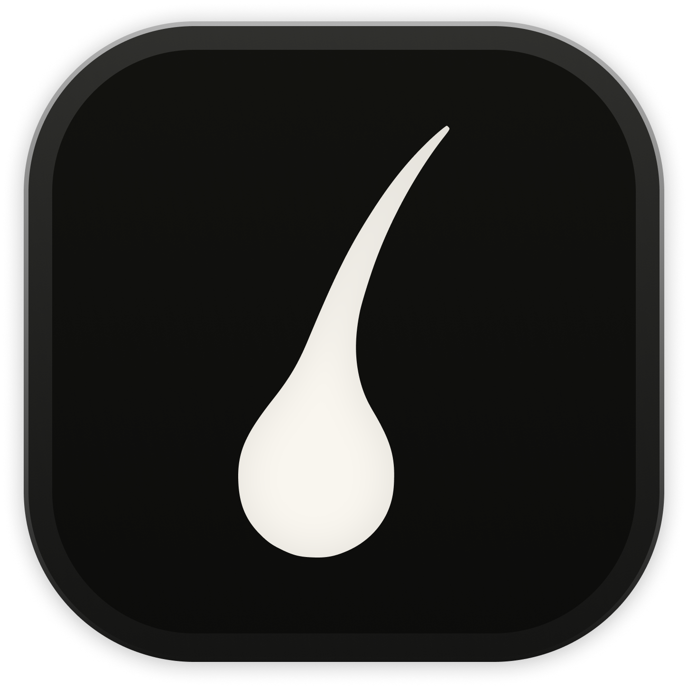

  
  

   
  

  <h1 align="center"><b>Root</b></h1>
  

  Effortless hair loss diagnosis.
     
    <a href="https://tryroot.ai"><strong>tryroot.ai »</strong></a>
     
     
    <b>Available for </b>
    iOS & Android
     
    <i>~ Links will be added once a release is available. ~</i>
  

Safe is an open source mobile platorm to discretely capture incidents with ease, powered by a multithreaded compression engine (<a href="#infrastructure">SMCE</a>) written in native Swift and Kotlin.
 
 

> NOTE: Root is under active development, most of the listed features are still in testing and could be altered.

With the press of a button, begin to record your front camera, upload the footage to the cloud in real-time, track your exact location, notify your emergency contacts through SMS and Whatsapp, and alert 911 if necessary. Emergency contacts (*and 911*) will receive a video and location livestream of the incident while also getting access to key information such as realtime updates of your battery life.

# Motivation

Lorem ipsum